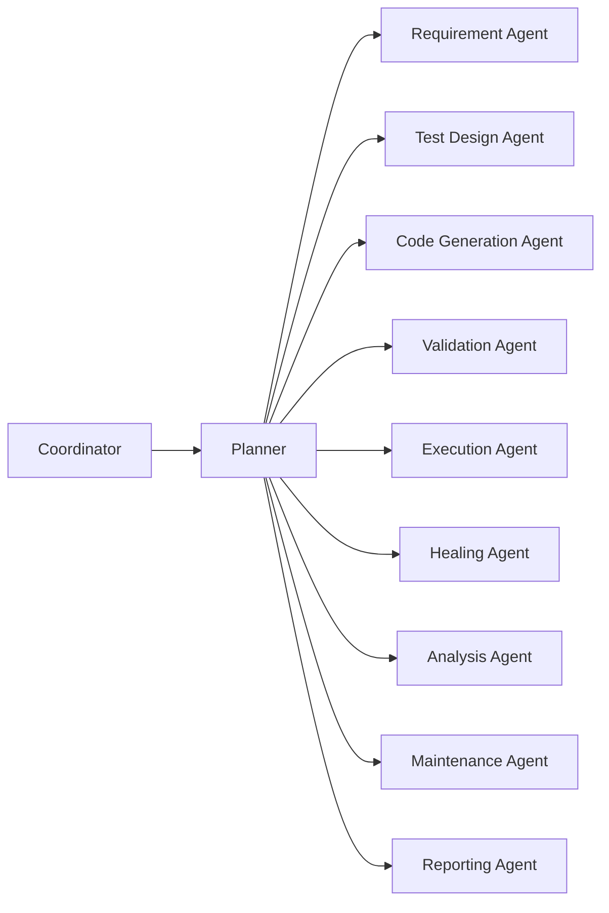
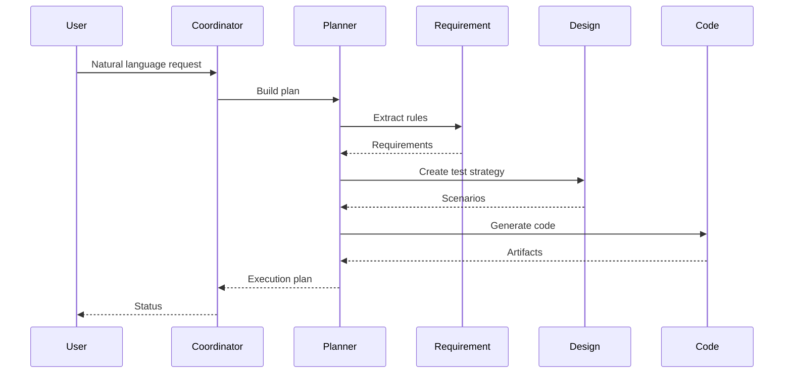

# Agent Design

## Goals
- Agents behave like senior QA engineers
- Deterministic outputs with traceability
- Safe autonomous execution with audits

## Agent topology

## Agent interaction sequence

## Observability and audit
- Every agent writes structured logs
- Each action produces an audit record
- Outputs include confidence scores

## Future considerations
- Model routing and evaluation loops
- Agent memory and retrieval augmentation
