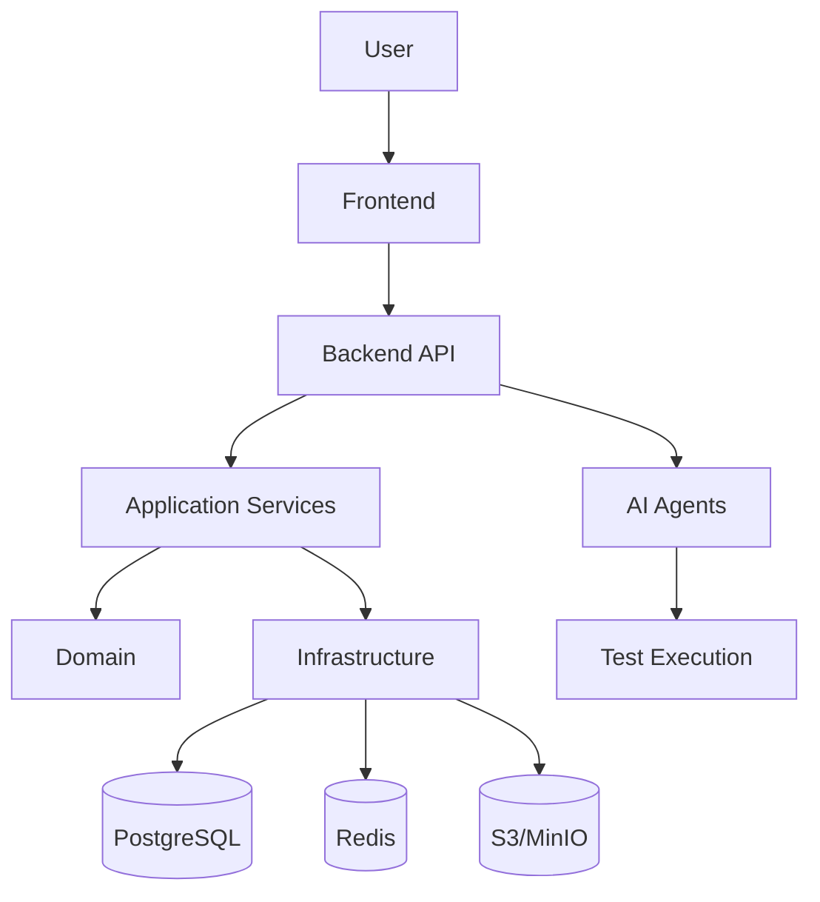
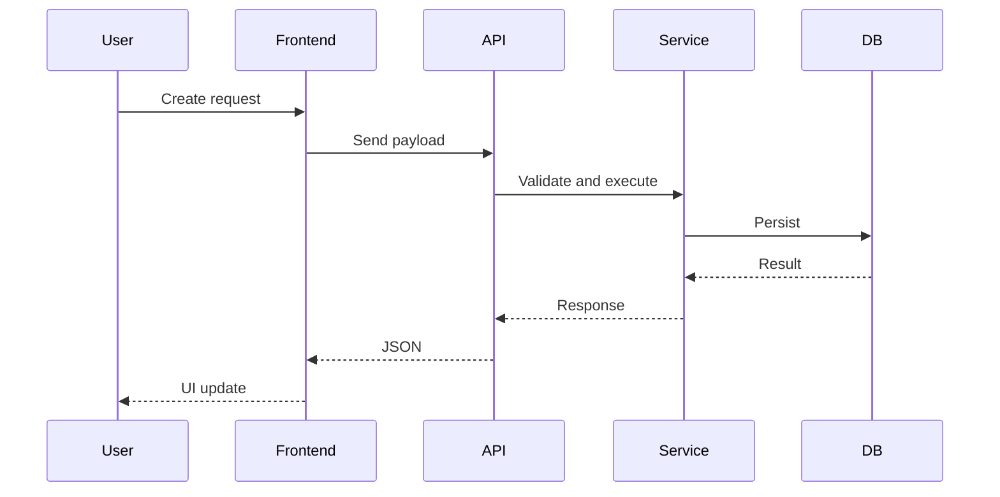

# Architecture Overview

## Architecture decisions
- Clean Architecture boundaries for backend
- Domain-first modeling with explicit services
- Event-ready design for future asynchronous workflows
- Multi-tenant, zero-trust posture from the start

## High-level system diagram

## Data flow

## Boundary rules
- API layer depends only on application layer
- Application layer depends on domain abstractions
- Infrastructure implements domain interfaces
- Domain does not depend on other layers

## Future considerations
- Agent orchestration via LangGraph
- Event bus for execution pipelines
- Modular deployment for agents and workers
