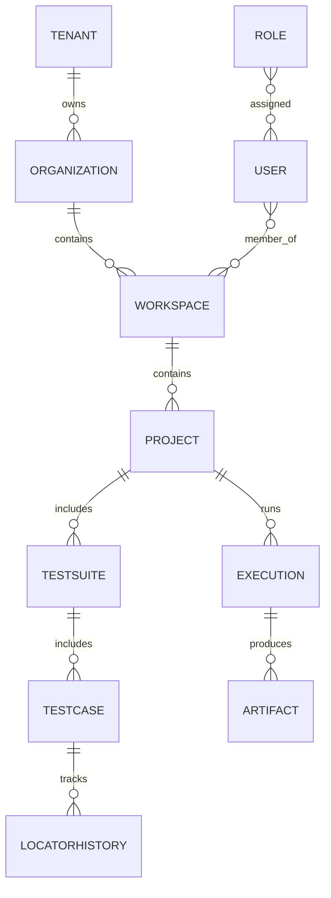

# Database Design

## Goals
- Support multi-tenancy and workspace isolation
- Track executions, artifacts, and healing history
- Enable analytics and risk modeling

## Core entities
- Tenant
- Organization
- Workspace
- Project
- User
- Role
- TestSuite
- TestCase
- Execution
- Artifact
- LocatorHistory

## Entity relationship sketch

## Future considerations
- Partitioning by tenant
- Audit log retention policies
- Encryption at rest and in transit
