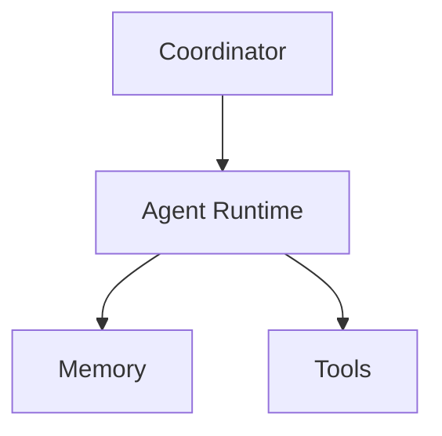
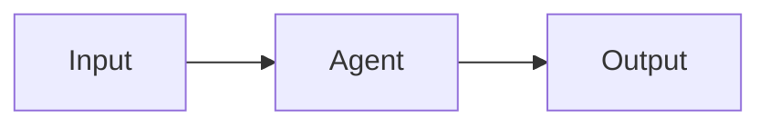
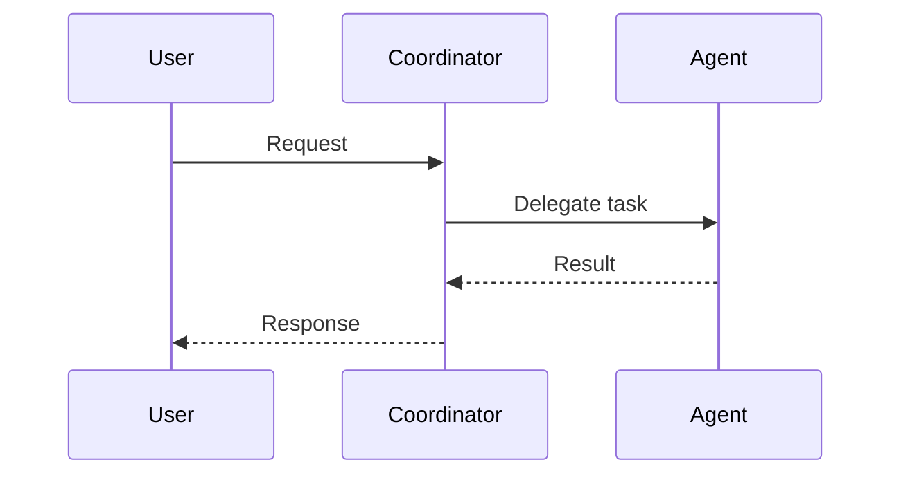

# agents

## Purpose
Define AI agent roles, policies, and orchestration logic for Veriq.

## Responsibilities
- Describe agent behaviors and capabilities
- Coordinate multi-agent workflows
- Provide audit and observability metadata

## Architecture Diagram

## Flow Diagram

## Sequence Diagram

## Usage Examples
- Add a new agent definition under agents/.
- Update routing rules in the coordinator.

## Troubleshooting
- Validate model credentials and tool permissions.
- Check agent logs for missing context.
