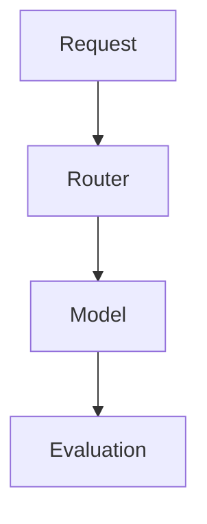
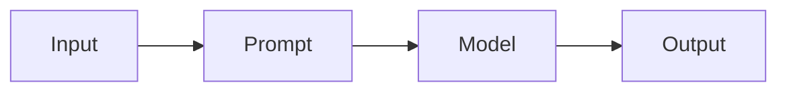
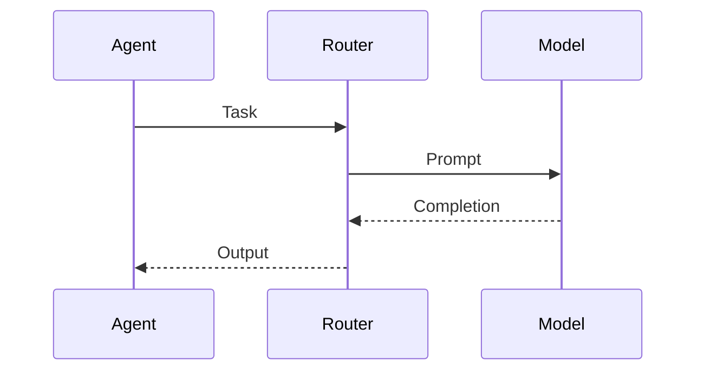

# ai

## Purpose
Centralize AI model routing, prompts, and evaluation logic.

## Responsibilities
- Select models based on task and policy
- Manage prompt templates and guardrails
- Track evaluation metrics and cost usage

## Architecture Diagram

## Flow Diagram

## Sequence Diagram

## Usage Examples
- Add a new model provider adapter.
- Update prompt templates for test design.

## Troubleshooting
- Check model credentials and quotas.
- Review evaluation logs for failures.
