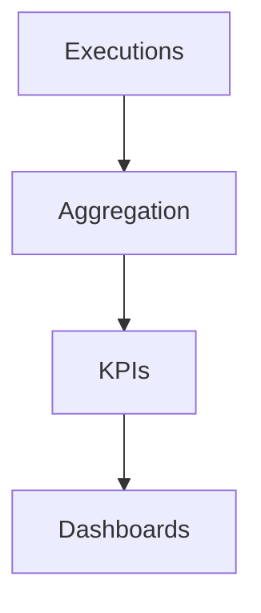
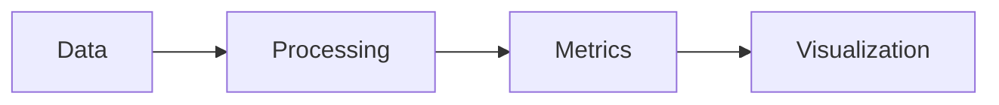
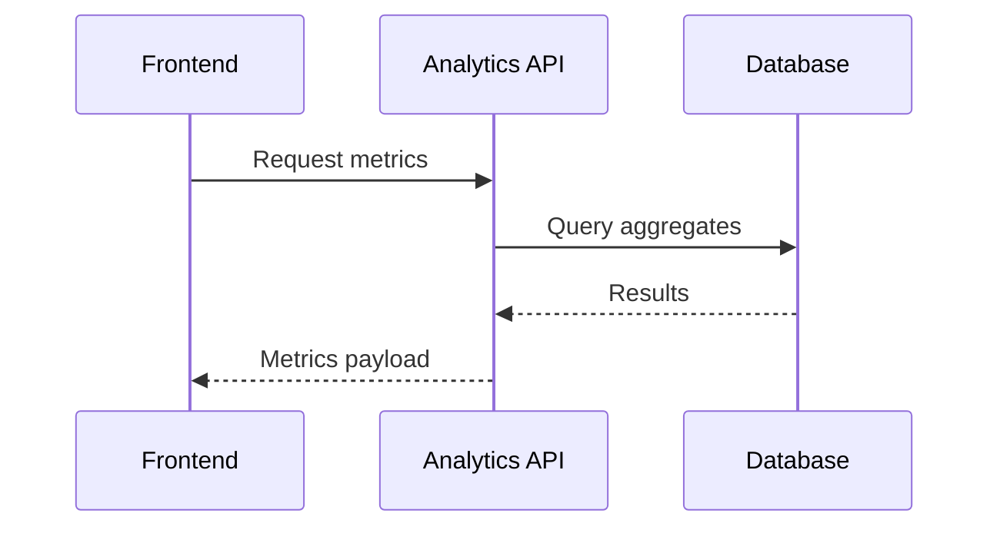

# analytics

## Purpose
Provide analytics services and metrics for Veriq dashboards.

## Responsibilities
- Aggregate execution metrics and trends
- Compute quality and risk KPIs
- Serve analytics data to the frontend

## Architecture Diagram

## Flow Diagram

## Sequence Diagram

## Usage Examples
- Add new metric aggregations for dashboards.
- Extend trend analysis queries.

## Troubleshooting
- Validate aggregation jobs are running.
- Check data freshness windows.
