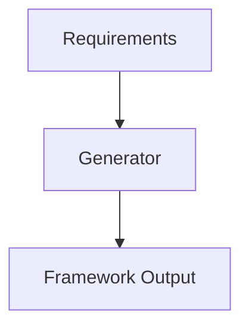
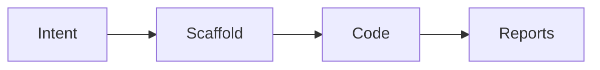
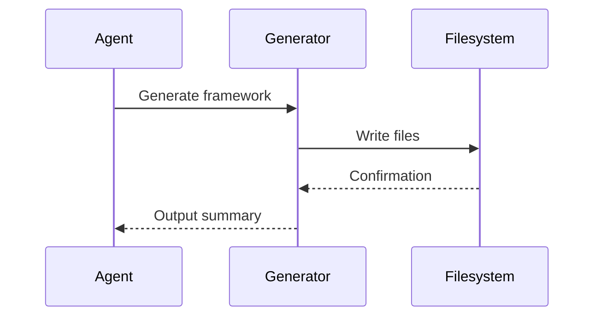

# automation

## Purpose
Generate and maintain automation frameworks and test code.

## Responsibilities
- Scaffold frameworks and project layouts
- Generate page objects, fixtures, and utilities
- Enforce testing standards and best practices

## Architecture Diagram

## Flow Diagram

## Sequence Diagram

## Usage Examples
- Generate a Playwright framework from a requirement.
- Add shared utilities for assertions.

## Troubleshooting
- Confirm target language toolchain is installed.
- Review generator logs for template errors.
