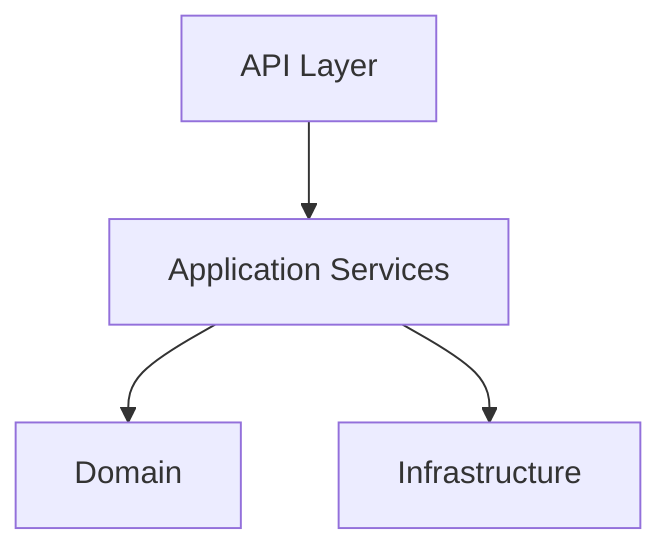
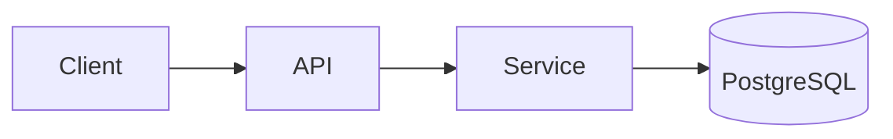
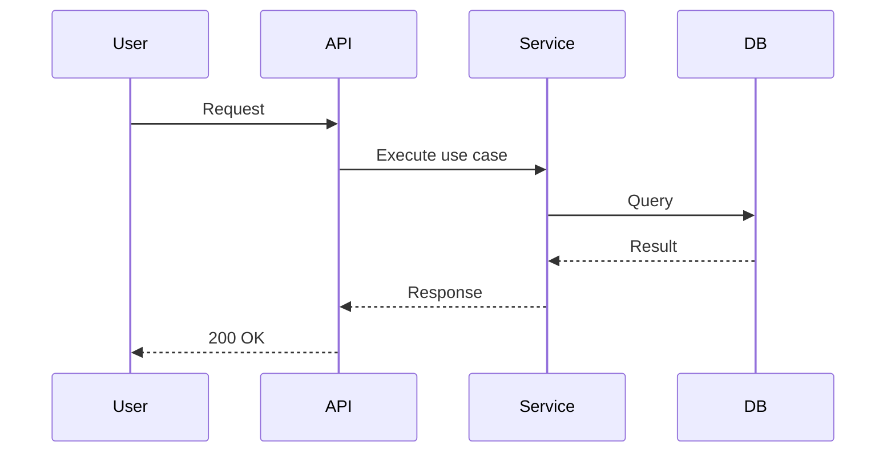

# backend

## Purpose
The backend provides the Veriq API, orchestration foundation, and core services required for autonomous test engineering.

## Responsibilities
- Expose REST APIs and OpenAPI documentation
- Enforce clean architecture boundaries
- Manage configuration, database, cache, and task queues

## Architecture Diagram

## Flow Diagram

## Sequence Diagram

## Usage Examples
- Start the API: uvicorn veriq.main:app --reload
- Call health: GET /api/v1/health

## Troubleshooting
- Check VERIQ_DATABASE_URL if DB connectivity fails.
- Ensure Redis is running for Celery broker settings.
