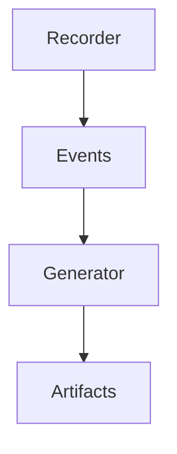
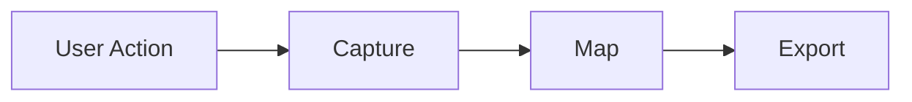
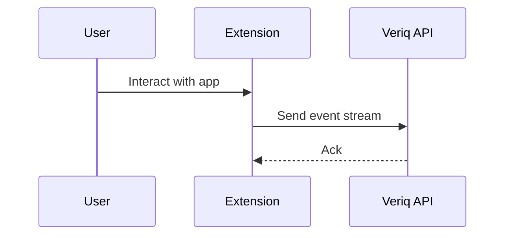

# browser-extension

## Purpose
Capture user interactions in the browser and translate them into automation artifacts.

## Responsibilities
- Record clicks, typing, and navigation
- Generate page objects and assertions
- Export workflows to Veriq

## Architecture Diagram

## Flow Diagram

## Sequence Diagram

## Usage Examples
- Record a login flow for automation.
- Export page object candidates.

## Troubleshooting
- Check extension permissions.
- Confirm network access to the API.
