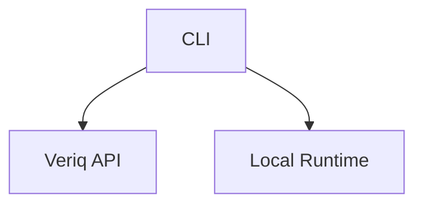
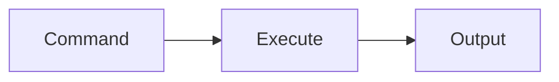
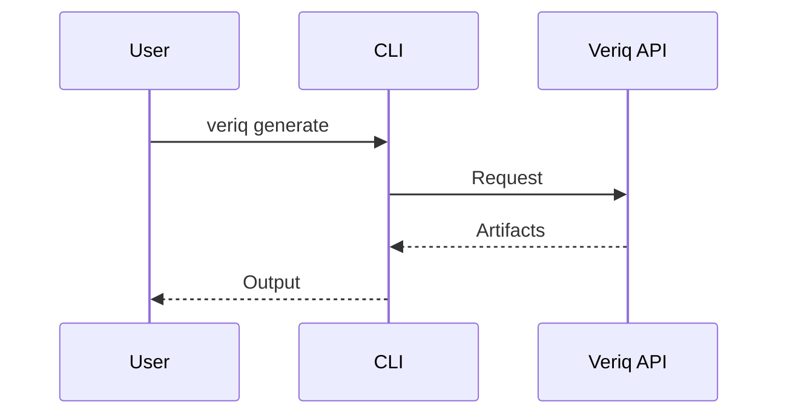

# cli

## Purpose
Provide a command-line interface for Veriq automation workflows.

## Responsibilities
- Generate tests from natural language
- Execute suites and report results
- Heal failures and analyze defects

## Architecture Diagram

## Flow Diagram

## Sequence Diagram

## Usage Examples
- veriq generate "Verify login fails"
- veriq run --suite smoke

## Troubleshooting
- Ensure API endpoint is reachable.
- Validate CLI configuration files.
