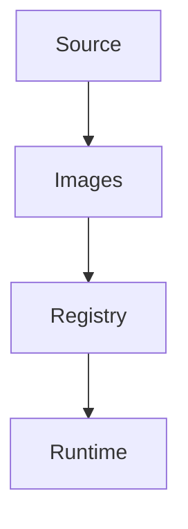
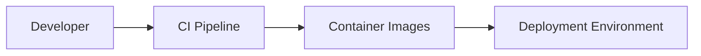
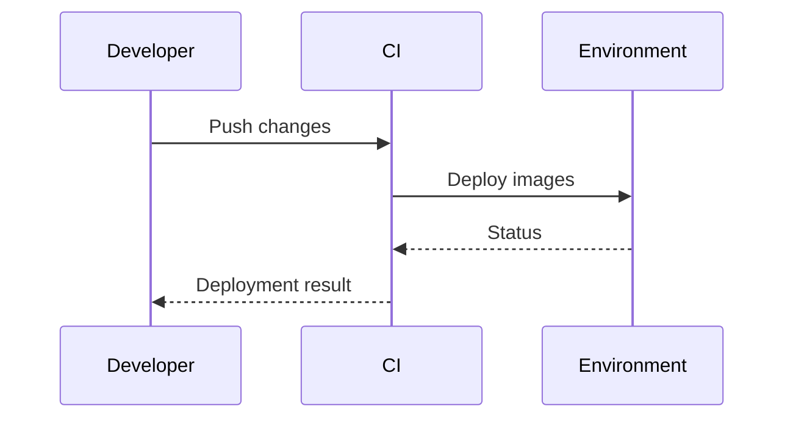

# deployment

## Purpose
Document deployment strategies and operational practices for Veriq.

## Responsibilities
- Define local and production deployment steps
- Provide environment and secret management guidance

## Architecture Diagram

## Flow Diagram

## Sequence Diagram

## Usage Examples
- docker compose up --build
- Configure environment variables from .env

## Troubleshooting
- Verify Docker networking and exposed ports.
- Confirm .env values match your services.
