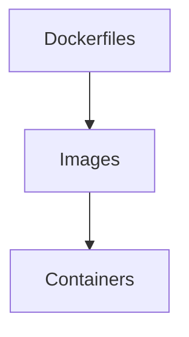
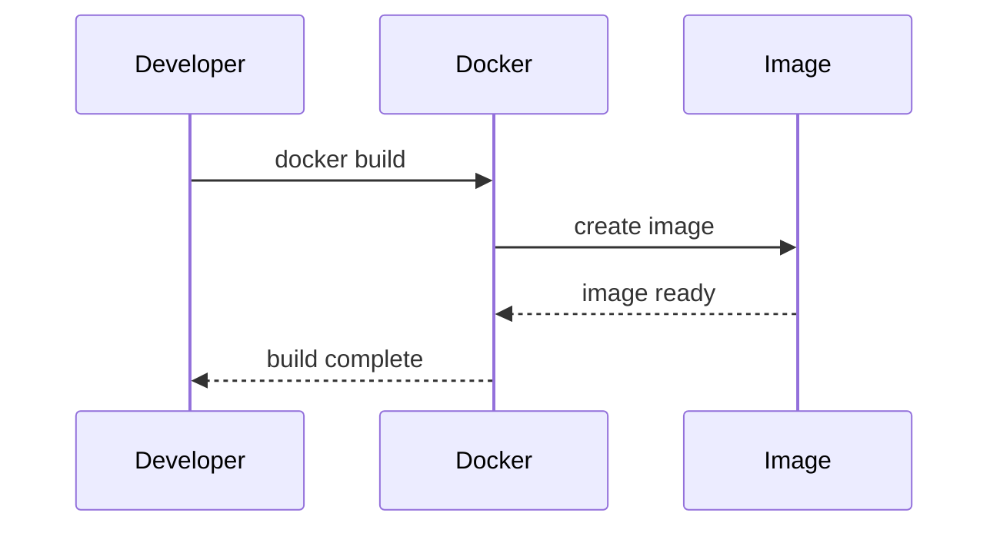

# docker

## Purpose
Provide container images and build assets for Veriq services.

## Responsibilities
- Define backend and frontend Docker images
- Standardize runtime configuration for containers

## Architecture Diagram

## Flow Diagram

## Sequence Diagram

## Usage Examples
- docker build -f docker/backend.Dockerfile .
- docker build -f docker/frontend.Dockerfile .

## Troubleshooting
- Ensure Docker Desktop is running.
- Rebuild without cache if dependencies change.
