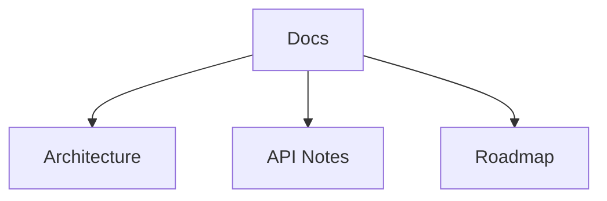
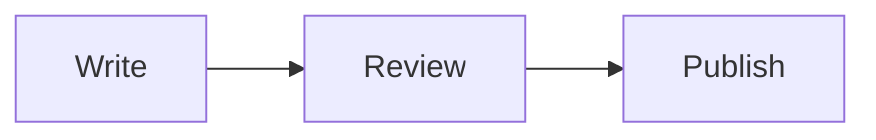
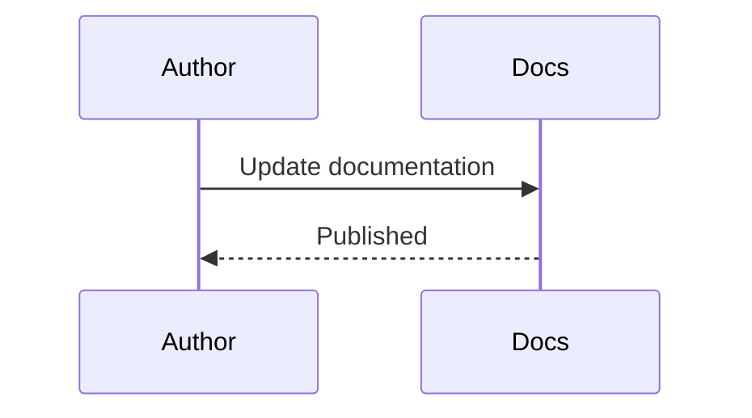

# docs

## Purpose
Store extended documentation and diagrams for Veriq.

## Responsibilities
- Maintain deep-dive documentation
- Host architecture and API notes
- Track roadmap discussions

## Architecture Diagram

## Flow Diagram

## Sequence Diagram

## Usage Examples
- Add diagrams for new subsystems.
- Update API notes after changes.
- Review phase details in docs/phase-1-auth.md.

## Troubleshooting
- Ensure links point to current files.
- Keep diagrams in sync with code.
