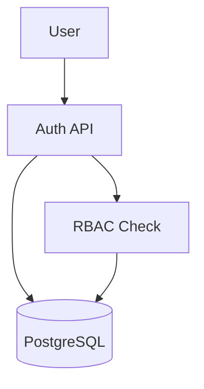
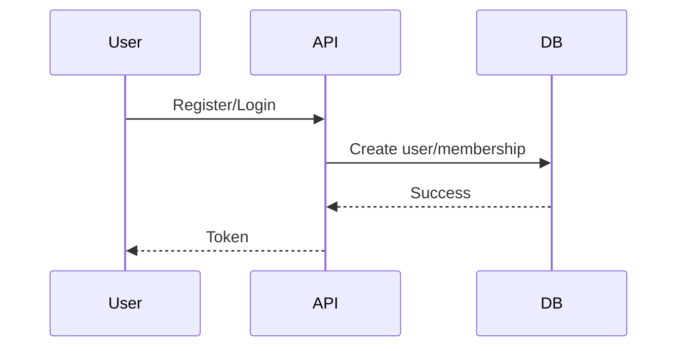

# Phase 1 - Authentication and Workspaces

## Architecture decisions
- JWT access tokens with short expiry for API authentication
- Role-based access control enforced via workspace memberships
- Tenant-scoped data isolation through tenant identifiers

## Folder structure
- backend/veriq/infrastructure/db/models.py for ORM entities
- backend/veriq/application/services/* for auth, org, workspace, project logic
- backend/veriq/api/v1/routes/* for Phase 1 endpoints
- backend/veriq/api/dependencies/* for auth dependencies

## Database changes
- tenants, organizations, workspaces, projects
- users, roles, workspace_memberships

## APIs
- POST /api/v1/auth/register
- POST /api/v1/auth/login
- GET /api/v1/auth/me
- GET/POST /api/v1/organizations
- GET /api/v1/workspaces
- POST /api/v1/workspaces/organizations/{organization_id}
- GET /api/v1/workspaces/{workspace_id}/detail
- GET/POST /api/v1/projects/workspaces/{workspace_id}

## Models
- Tenant, Organization, Workspace, Project
- User, Role, WorkspaceMembership

## Services
- auth_service for registration and login
- organization_service for org lifecycle
- workspace_service for workspace lifecycle
- project_service for project lifecycle

## Tests
- Unit tests for slug utility and auth service
- Integration tests for auth endpoints

## Documentation
- API docs updated in API_DOCUMENTATION.md
- This phase overview in docs/phase-1-auth.md

## Diagrams

## Future considerations
- Refresh tokens and session revocation
- SSO and SCIM support
- Organization-level roles and policies
