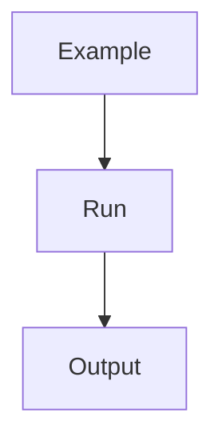
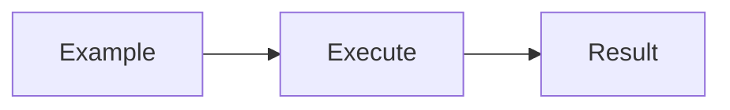
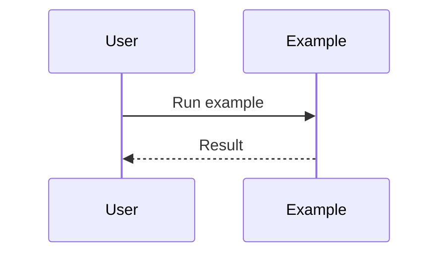

# examples

## Purpose
Provide runnable examples and reference flows.

## Responsibilities
- Showcase common workflows
- Demonstrate SDK and CLI usage
- Offer templates for new users

## Architecture Diagram

## Flow Diagram

## Sequence Diagram

## Usage Examples
- Run a sample login test generation.
- Validate execution outputs.

## Troubleshooting
- Confirm environment variables are set.
- Check sample dependencies.
