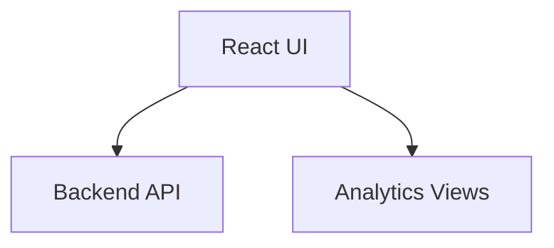
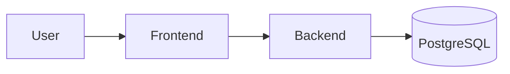
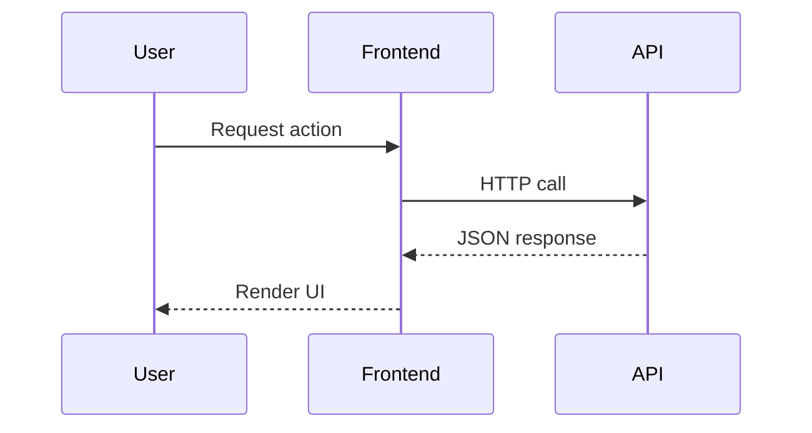

# frontend

## Purpose
The frontend delivers the Veriq user experience for planning, execution, and analytics.

## Responsibilities
- Present dashboards and reports
- Surface agent actions and execution status
- Provide entry points for test generation

## Architecture Diagram

## Flow Diagram

## Sequence Diagram

## Usage Examples
- Start dev server: npm run dev
- Build for production: npm run build

## Troubleshooting
- Ensure Node 20+ is installed.
- Run npm install if dependencies are missing.
