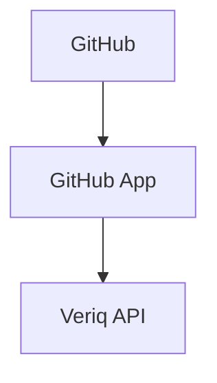
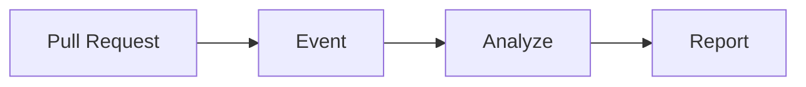
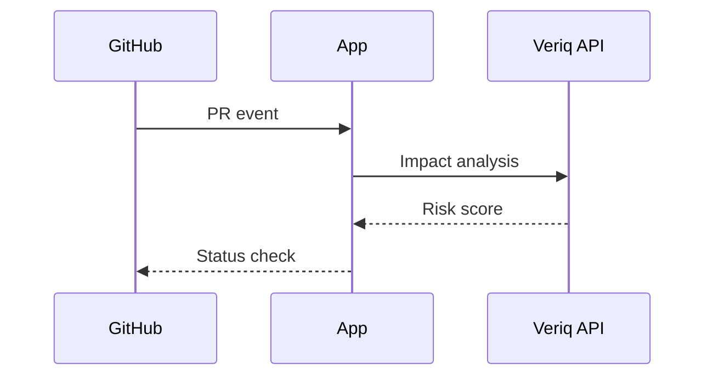

# github-app

## Purpose
Provide GitHub-native workflows for PR analysis and test recommendations.

## Responsibilities
- Monitor pull requests and changes
- Generate impacted tests and risk scores
- Post reports and status checks

## Architecture Diagram

## Flow Diagram

## Sequence Diagram

## Usage Examples
- Enable Veriq checks on PRs.
- Generate targeted regression suites.

## Troubleshooting
- Verify webhook delivery.
- Confirm GitHub App permissions.
