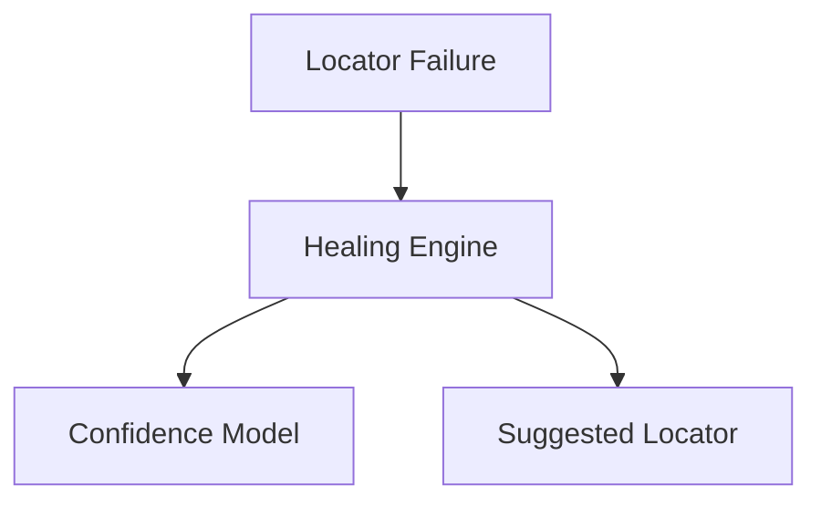
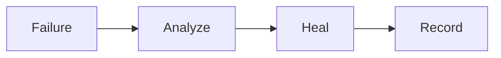
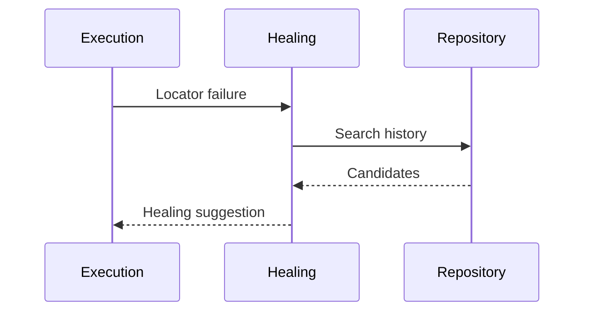

# healing

## Purpose
Detect and repair broken locators and flaky tests.

## Responsibilities
- Track locator history and confidence scores
- Apply similarity and AI prediction strategies
- Record healing decisions for audits

## Architecture Diagram

## Flow Diagram

## Sequence Diagram

## Usage Examples
- Run locator healing after failed UI tests.
- Review healing history for audit trails.

## Troubleshooting
- Ensure DOM snapshots are captured.
- Verify similarity thresholds.
