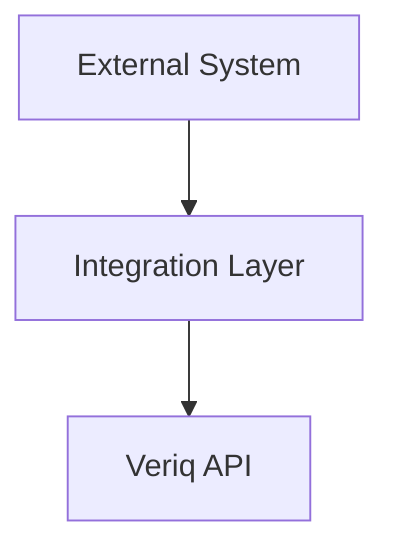
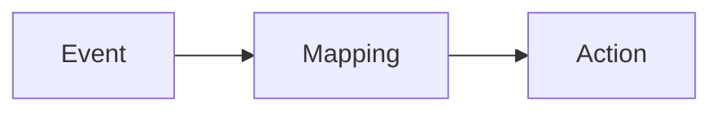
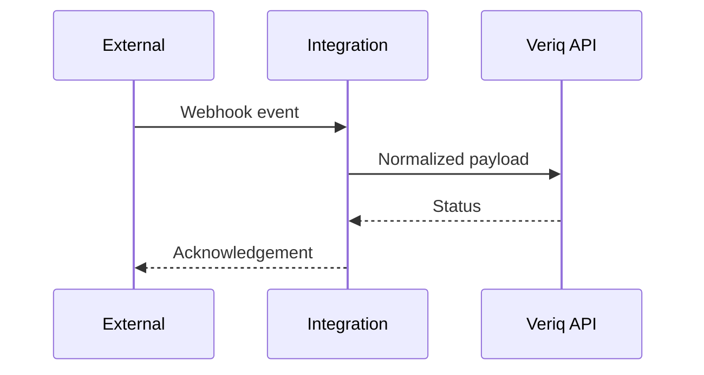

# integrations

## Purpose
Provide connectors and workflows for external systems.

## Responsibilities
- Integrate with CI/CD platforms and trackers
- Expose webhooks and outbound notifications
- Normalize external events into Veriq workflows

## Architecture Diagram

## Flow Diagram

## Sequence Diagram

## Usage Examples
- Add a GitHub webhook handler.
- Integrate with Jira for defect creation.

## Troubleshooting
- Verify webhook signatures.
- Confirm network access to third-party APIs.
