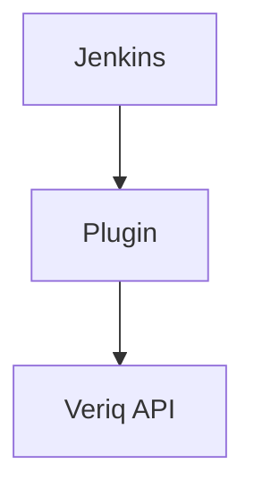
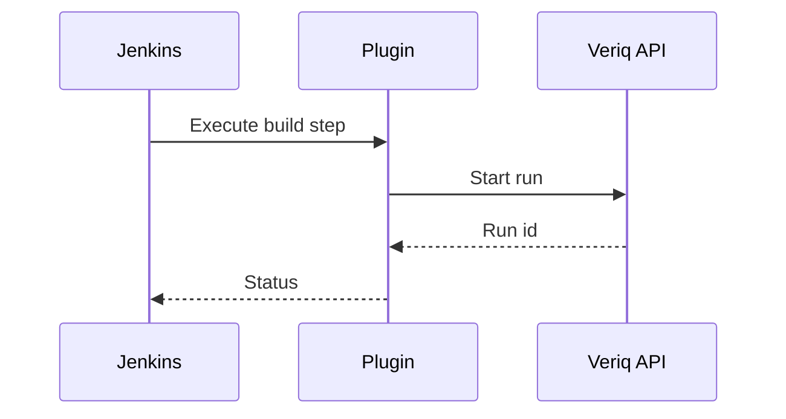

# jenkins-plugin

## Purpose
Integrate Veriq execution and reporting into Jenkins pipelines.

## Responsibilities
- Trigger Veriq test runs from Jenkins
- Publish results and artifacts
- Support pipeline configuration

## Architecture Diagram

## Flow Diagram

## Sequence Diagram

## Usage Examples
- Add a pipeline step to trigger Veriq.
- Archive test reports in Jenkins.

## Troubleshooting
- Validate API credentials.
- Check Jenkins plugin logs.
