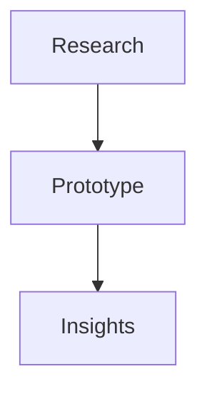
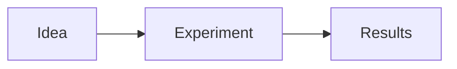
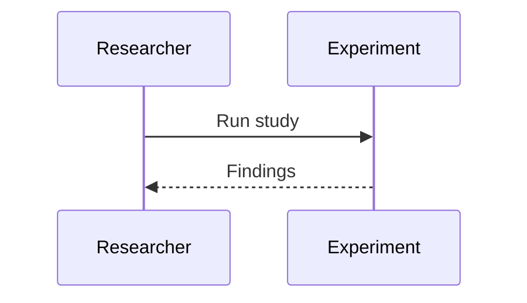

# research

## Purpose
Track experimental work, prototypes, and evaluations.

## Responsibilities
- Validate new AI approaches
- Prototype workflows before production
- Capture research findings

## Architecture Diagram

## Flow Diagram

## Sequence Diagram

## Usage Examples
- Evaluate a new model routing strategy.
- Compare locator healing algorithms.

## Troubleshooting
- Document experiment parameters.
- Separate experimental code from production.
