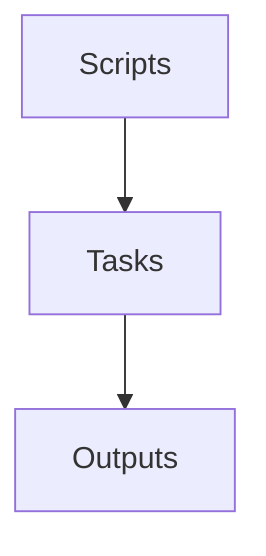
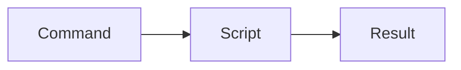
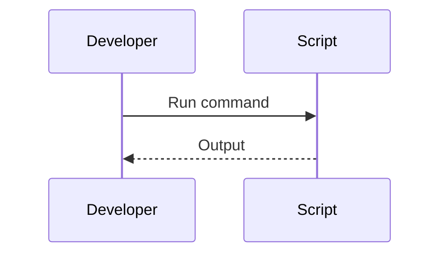

# scripts

## Purpose
Host operational and developer scripts for Veriq.

## Responsibilities
- Automate common dev tasks
- Support CI and maintenance workflows
- Provide repeatable utility commands

## Architecture Diagram

## Flow Diagram

## Sequence Diagram

## Usage Examples
- Run environment bootstrap scripts.
- Execute data cleanup utilities.

## Troubleshooting
- Ensure script permissions are set.
- Review script logs for errors.
