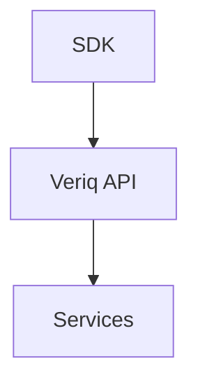
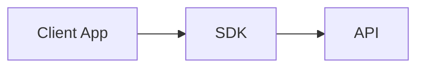
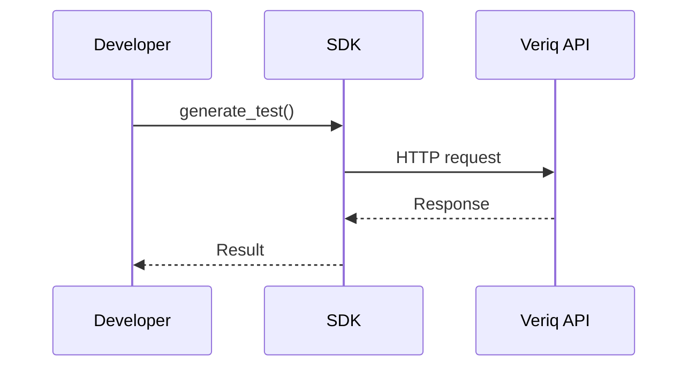

# sdk

## Purpose
Provide SDKs for integrating Veriq into existing workflows.

## Responsibilities
- Offer typed SDKs for supported languages
- Wrap API calls with ergonomic helpers
- Support authentication and retries

## Architecture Diagram

## Flow Diagram

## Sequence Diagram

## Usage Examples
- veriq.generate_test("checkout flow")
- veriq.execute("smoke")

## Troubleshooting
- Verify API keys and endpoints.
- Enable SDK debug logging.
