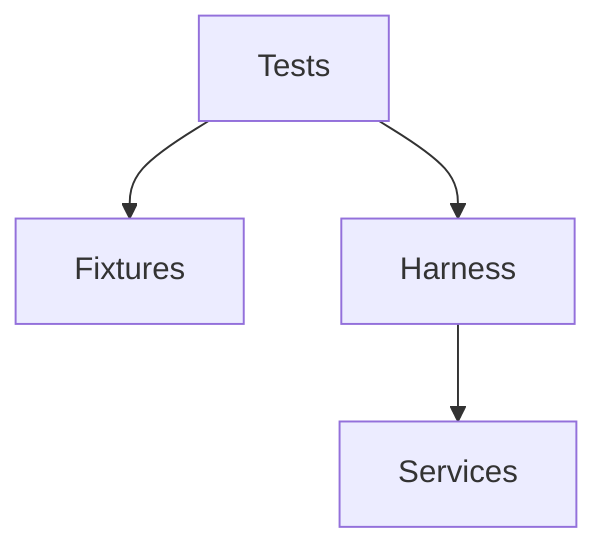
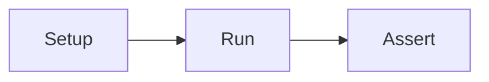
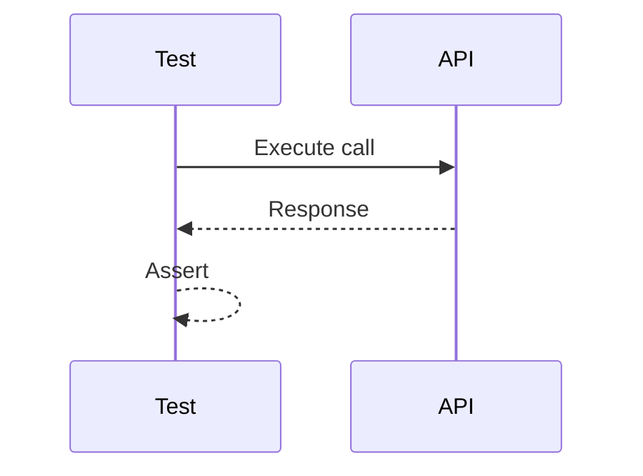

# tests

## Purpose
Provide shared test assets and cross-module test harnesses.

## Responsibilities
- Maintain integration test scaffolding
- Store shared fixtures and utilities
- Support system-level verification

## Architecture Diagram

## Flow Diagram

## Sequence Diagram

## Usage Examples
- Add integration suites for new APIs.
- Share fixtures across modules.

## Troubleshooting
- Ensure services are running for integration tests.
- Validate fixture data integrity.
